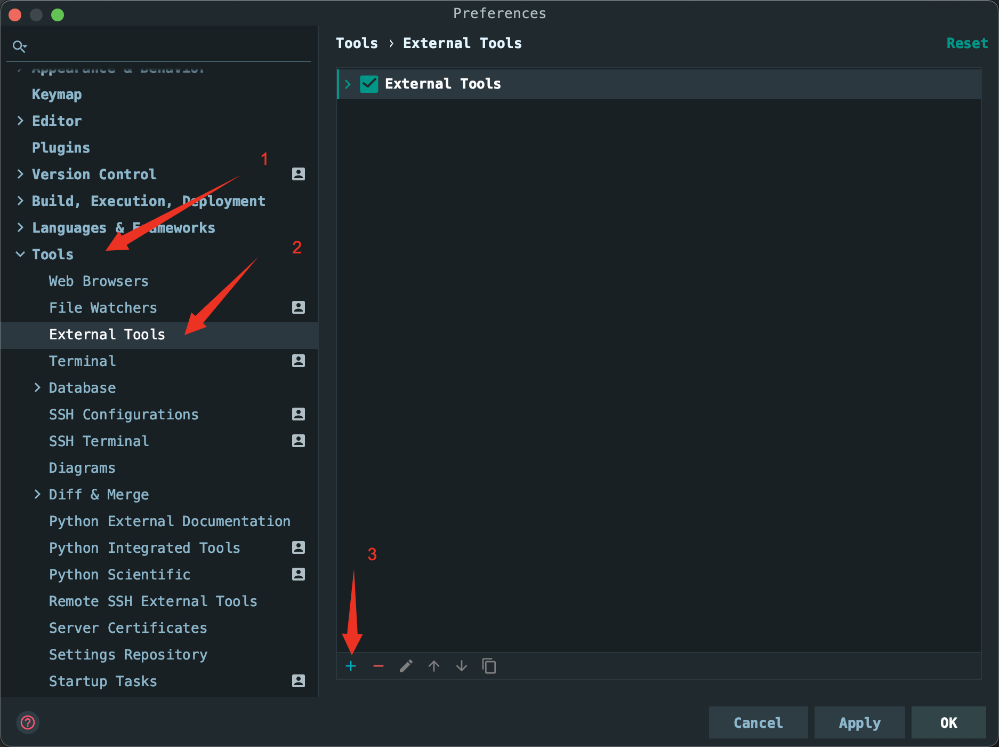
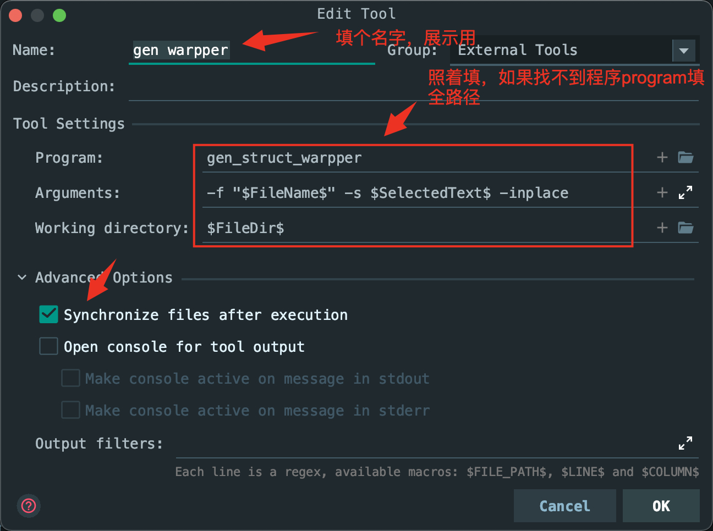
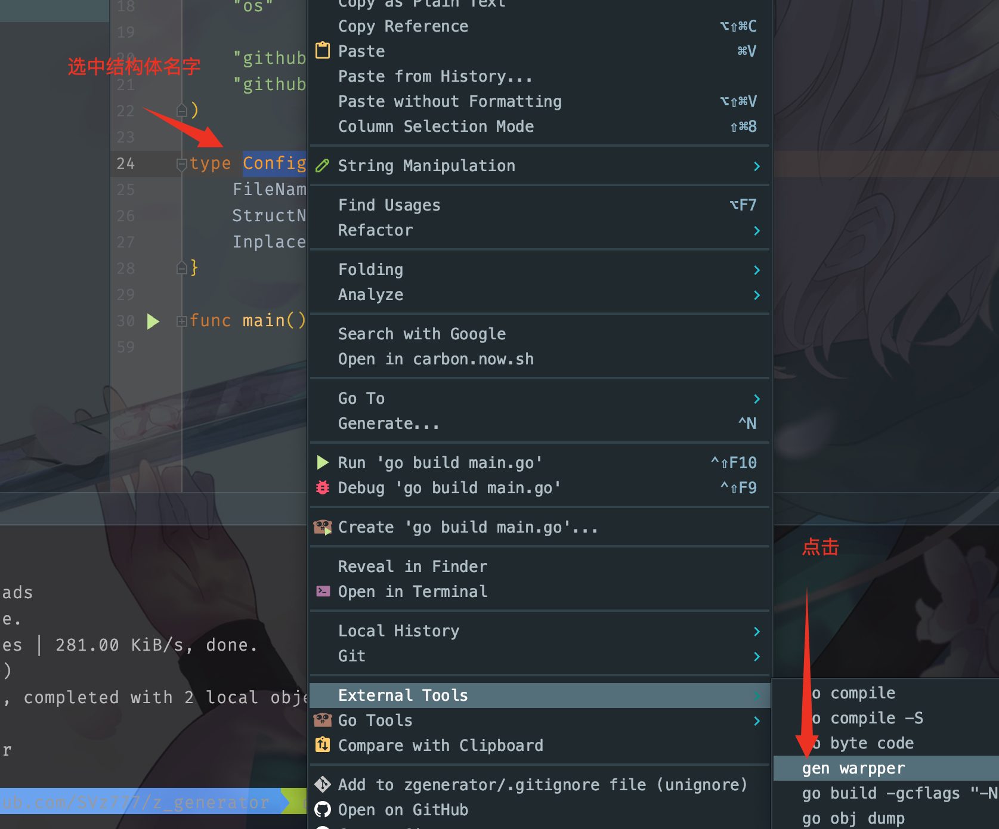

# 安装方法

git clone git@github.com:SVz777/z_generator.git

go install github.com/SVz777/z_generator.git/cmd/z_gen 这里会把二进制文件拷贝到${GOPATH}/bin下

到这就安装完成了，可以直接 z_gen 查看使用方法

# 配合idea使用




为了方便，我把配置放这
```
z_gen
-f "$FileName$" -s $SelectedText$ -inplace
$FileDir$
```

